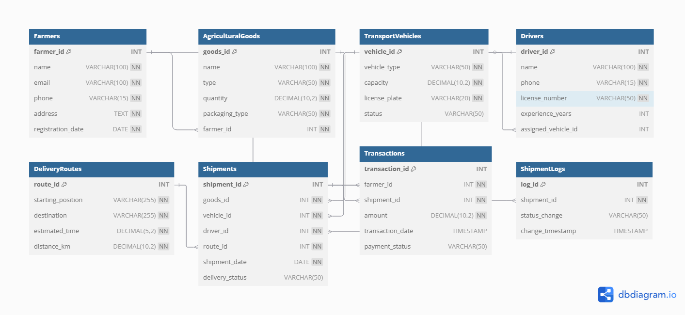

#Agricultural Goods Transportation Management System

  ##Project Description:
    The Agricultural Goods Transportation Management System is a relational database designed to streamline logistics for farmers. It enables efficient tracking of 
    agricultural goods, transport vehicles, drivers, delivery routes, shipments, and transactions. This database system helps farmers manage agricultural goods 
    transportation efficiently. 
    
 ###Key Features:
    - **Farmer Management:** Store farmer details and their agricultural goods. 
    - **Transport Logistics:** Assign drivers and track transport vehicles. 
    - **Shipment Tracking:** Monitor goods from pickup to destination. 
    - **Payment Processing:** Manage transactions for transportation services. 
    - **Performance Optimizations:** Indexed key fields for faster queries.
  
 ##How to Set Up the Database
  ### **Step 1: Install MySQL**
  Ensure MySQL is installed on your system. You can download it [here](https://dev.mysql.com/downloads/).
  
  ### **Step 2: Clone the Repository**
  git clone https://github.com/Tam1988/Agricultural-Transport-DB.git
  cd agricultural-transport-db
  
  ### **Step 3: Import the SQL Schema**
  Open MySQL and execute:
  SOURCE AgriculturalTransportDB.sql;
  This will create the database and all required tables automatically.
  
 ##Entity-Relationship Diagram (ERD)
  Here’s the ERD representation of the database structure:
  
 
 ##Repository Contents
  agricultural-transport-db/
  │── AgriculturalTransportDB.sql   # Well-commented SQL schema file
  │── README.md                     # Project documentation
  │── ERD.png                       # ERD diagram image
  
